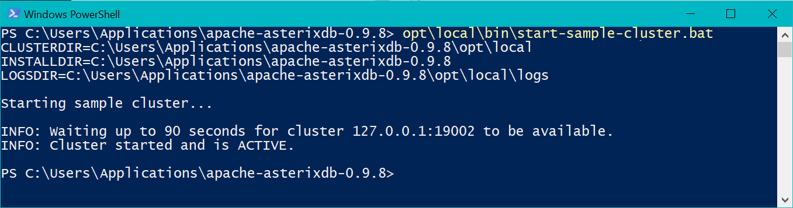
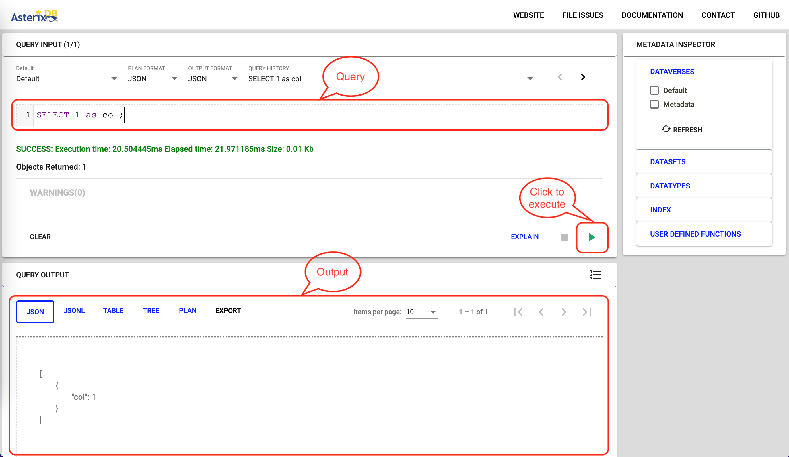

# Lab 10

## Objectives

* Manage big data using [Apache AsterixDB](https://asterixdb.apache.org/).
* Download real datasets and load them into AsterixDB.
* Run SQL queries and visualize the results.

---

## Prerequisites

* Download [AsterixDB-0.9.8](http://www.apache.org/dyn/closer.lua/asterixdb/asterixdb-0.9.8/asterix-server-0.9.8-binary-assembly.zip)
  * Link to [Documentation](https://asterixdb.apache.org/docs/0.9.8/index.html)
* Download JDK 11 or later. JDK 8 will not work for this lab.
* Download and decompress this [sample file](chicago_crimes_sample.csv.gz) for testing.
* Download the [template spreadsheet](./visualizations.xlsx) for the visualizations requested later.

---

## Lab Work

### I. Install JDK 11+ - 10 minutes (in home)

AsterixDB requires Java 11+ to run. It does not have strict requirement for which Java distribution (Oracle JDK or OpenJDK) to use, you can choose whatever JDK to use. Here we provide an instruction for Oracle JDK 11 below. You can use other method to install the JDK such as an installer (.deb, .exe or .pkg) or `apt` command, but make sure you can find where it is installed.

1. Download Oracle JDK 11.
   * Linux: Download **x64 Compressed Archive (jdk-11.0.15.1_linux-x64_bin.tar.gz)** from [here](https://www.oracle.com/java/technologies/downloads/#java11-linux).
   * macOS: Download **x64 Compressed Archive (jdk-11.0.15.1_osx-x64_bin.tar.gz)** from [here](https://www.oracle.com/java/technologies/downloads/#java11-mac).
   * Windows: Download **x64 Compressed Archive (jdk-11.0.15.1_windows-x64_bin.zip)** from [here](https://www.oracle.com/java/technologies/downloads/#java11-windows).

2. Untar (Linux and macOS) or unzip (Windows) the downloaded archive file to your **cs167** folder.

3. Change your environment variable `JAVA_HOME`, which points to Oracle JDK 8 form previous labs, to the untar'ed or unzipped the folder.
   * Linux: ~~`$HOME/cs167/jdk1.8.0_333`~~ &#8594; `$HOME/cs167/jdk-11.0.15.1`
   * macOS: ~~`/Library/Java/JavaVirtualMachines/jdk1.8.0_333.jdk/Contents/Home`~~ &#8594; `$HOME/cs167/jdk-11.0.15.1.jdk/Contents/Home`
   * Windows: ~~`C:\cs167\jdk1.8.0_333`~~ &#8594; `C:\cs167\jdk-11.0.15.1`

4. Reload your environment by running the `source` command (Linux and macOS) or restarting the terminal app.

5. Test your new `JAVA_HOME`
   * Linux and macOS: `echo $JAVA_HOME`
   * Windows CMD: `echo %JAVA_HOME%`
   * Windows PowerShell: `echo $Env:JAVA_HOME`

   It should print the path which contains `jdk-11.0.15.1` (Linux and Windows) or `jdk-11.0.15.1.jdk` (macOS).

6. Test your `java` version.

   ```bash
   java -version
   ```

   It should print

   ```text
   java version "11.0.15.1" 2022-04-22 LTS
   Java(TM) SE Runtime Environment 18.9 (build 11.0.15.1+2-LTS-10)
   Java HotSpot(TM) 64-Bit Server VM 18.9 (build 11.0.15.1+2-LTS-10, mixed mode)
   ```

### II. Install and Start AsterixDB - 5 minutes (in home)

1. Extract AsterixDB into your `cs167` under your home directory.

2. To start a local cluster of AsterixDB, open a command line window at the extracted AsterixDB directory (**apache-asterixdb-0.9.8**) and run the following command.

   You can also use the absolute path to the **start-sample-cluster.{sh | bat}** file.

   * Linux and macOS

     ```bash
     ./opt/local/bin/start-sample-cluster.sh
     ```

   * Windows (you can also go to **opt\local\bin** folder in Windows Explorer and double click the bat file to run it)

     ```powershell
     opt\local\bin\start-sample-cluster.bat
     ```

   You should see something like the following.

   

   Make sure you see `INFO: Cluster started and is ACTIVE.` in the output.

   To confirm that AsterixDB is running, point your web browser to the link [http://127.0.0.1:19006](http://127.0.0.1:19006). You should see AsterixDB interface as shown below.

   

   You can now close this terminal window if you want.

   Note: if you see errors starting/restarting AsterixDB, you can try shuting down AsterixDB first. See [VII. Stop AsterixDB](#vii-stop-asterixdb) for the command.

---

## III. Review the builtin function

1. Go through the [builtin functions of AsterixDB](https://asterixdb.apache.org/docs/0.9.8/sqlpp/builtins.html). Focus on numeric, string, temporal, and aggregate functions.
2. You can directly run the queries into the [web interface](http://127.0.0.1:19006) of AsterixDB for testing.
   
3. Run the following query.

   ```sql
   get_month(current_date())
   ```

   * ***(Q1) What is the result?***

---

## IV. Load Chicago Crime dataset into AsterixDB (20 minutes)

1. Create a dataverse for chicago crimes as below.

   ```sql
   DROP DATAVERSE chicago_crimes_sample IF EXISTS;

   CREATE DATAVERSE chicago_crimes_sample;
   ```

2. Create a data type for crimes.

   ```sql
   USE chicago_crimes_sample;

   CREATE TYPE ChicagoCrimeType AS {
     longitude: double?,
     latitude: double?,
     id: int32,
     case_number: string?,
     date_value: string?,
     block: string?,
     iucr: string?,
     primary_type: string?,
     description: string?,
     location_description: string?,
     arrest: string?,
     domestic: string?,
     beat: double?,
     district: double?,
     ward: double?,
     community_area: double?,
     fbi_code: string?,
     x_coordinate: double?,
     y_coordinate: double?,
     year: int32?,
     updated_on: string?
   };
   ```

   Note: The question mark `?` at the end of the name indicates an optional attribute.

3. Create a dataset and load the downloaded data. We assume that the downloaded file has been decompressed and is available under:

   * Linux and macOS: `~/cs167/merlin_lab8/chicago_crimes_sample.csv`
   * Windows: `C:\cs167\merlin_lab8\chicago_crimes_sample.csv`

   Run the following query (Note the [file URI](https://en.wikipedia.org/wiki/File_URI_scheme) must be an absolute path)

   ```sql
   USE chicago_crimes_sample;

   DROP DATASET ChicagoCrimes IF EXISTS;
   
   CREATE DATASET ChicagoCrimes (ChicagoCrimeType) PRIMARY KEY id;

   LOAD DATASET ChicagoCrimes USING localfs (
     ("path"="127.0.0.1:///Users/merlin/cs167/merlin_lab8/chicago_crimes_sample.csv"),
     ("format"="delimited-text"),
     ("delimiter"=","),
     ("header"="true")
   );

   SELECT COUNT(*) AS count FROM ChicagoCrimes;
   ```

   If the insertion is successful, you should see the following output.

   ```json
   [
     {
       "count": 125070
     }
   ]
   ```

   If it does not work and report error `ERROR: Code: 1 "ASX3077: .../chicago_crimes_sample.csv: path not found"`, try to replace the value of `"path"` in the query to the following format

   * Linux: `"127.0.0.1:///home/merlin/cs167/merlin_lab8/chicago_crimes_sample.csv"`
   * macOS: `"127.0.0.1:///Users/merlin/cs167/merlin_lab8/chicago_crimes_sample.csv"`
   * Windows 1: `"127.0.0.1:///Users/merlin/cs167/merlin_lab8/chicago_crimes_sample.csv"`
   * Windows 2: `"127.0.0.1:///c:/Users/merlin/cs167/merlin_lab8/chicago_crimes_sample.csv"`

---

## V. Analyze crime data (45 minutes)

1. Count how many arrests involve an arrest, i.e., `arrest="true"`?

   Hint, use the following SQL query.

   ```sql
   SELECT COUNT(arrest)
   FROM ChicagoCrimes
   WHERE arrest="true";
   ```

2. Which **unique** types of crimes have been recorded at `GAS STATION` locations?
   * ***(Q2) Which query did you use and what is the answer?***

   Hint: function `DISTINCT()`, columns `primary_type` and `location_description`.

3. Find the number of crimes by year and order the results by the number of crimes in **descending** order.
   * ***(Q3) Include the query in your README file***

   Hint: Use the function `parse_datetime()` with format `"MM/DD/YYYY hh:mm:ss a"` to parse the `date_value`. Then, use the function `get_year()` to get the year. You may also use the `year` column.

   Hint: The results will look like the following.

   ```json
   [
     {
       "year": 2018,
       "count": 8155
     },
     {
       "year": 2019,
       "count": 7931
     },
     {
       "year": 2017,
       "count": 7872
     },
     {
       "year": 2004,
       "count": 7520
     },
     {
       "year": 2003,
       "count": 7270
     },
     {
       "year": 2008,
       "count": 7162
     },
     {
       "year": 2011,
       "count": 6970
     },
     {
       "year": 2012,
       "count": 6950
     },
     {
       "year": 2006,
       "count": 6858
     },
     {
       "year": 2005,
       "count": 6814
     }
   ]
   ```

4. ***(Q4) Which `district` has the most number of crimes? Include the query and the answer in the README file.***

   Hint: Use [`ORDER BY` and `LIMIT`](https://asterixdb.apache.org/docs/0.9.8/sqlpp/manual.html#Order_By_clauses) to select the top record.

---

## VI. Visualize the result (30 minutes)

In this part, we will run the query in AsterixDB and visualize the result using a spreadsheet. Download this [template spreadsheet](./visualizations.xlsx) to help you with this part.

1. Run the following query to select the number of crimes per month over all years.

   ```sql
   USE chicago_crimes_sample;

   SELECT month_number, month_name, count(*) AS count FROM (
     SELECT print_datetime(parse_datetime(date_value, "MM/DD/YYYY hh:mm:ss a"), "MMMM") AS month_name,
            get_month(parse_datetime(date_value, "MM/DD/YYYY hh:mm:ss a")) AS month_number
     FROM ChicagoCrimes
   ) AS months
   GROUP BY month_name, month_number
   ORDER BY month_number;
   ```

   The answer will look similar to the following using `TABLE` output format.

   month_number  | month_name    | count
   ------------- | ------------- | -----
   1             | JANUARY       | 9536
   2             | FEBRUARY      | 8396
   3             | MARCH         | 9543
   4             | APRIL         | 9423
   5             | MAY           | 10842
   6             | JUNE          | 11405
   7             | JULY          | 12199
   8             | AUGUST        | 11983
   9             | SEPTEMBER     | 10482
   10            | OCTOBER       | 10726

2. To import this data into a CSV file, choose `TABLE` as the output format and then copy/paste the table into an Excel spreadsheet.
3. Create a visualization using Excel such as the following one.

   

   You can easily do that by copy/pasting the query results in the spreadsheet and the visualization should populate automatically.

4. Now, let us do a more complicated example. We would like to visualize the number of crimes by month/year so that we can see the trend over time.
5. Update the query above to produce a result simiar to the following.

   year_month | count
   ---------- | -----
   2001/01    | 4
   2001/02    | 2
   2001/04    | 3
   2001/05    | 4
   2001/07    | 6
   2001/08    | 4
   ...        | ...

   * ***(Q5) Include the query in your submission.***

6. Note that AsterixDB will only show the first 10 results by default.
   * ***(Q6) What is the total number of results produced by this query (not only the shown ones)?***

7. Copy the result into the second sheet of the provided Excel spreadsheet to produce a visualization similar to the one below.

   

   Note: You can make multiple copies on each page of the printed result and append them to the spreadsheet. To reduce the total number of copies, you can set the number of results per page to 200. Exporting to CSV functions seems to be buggy in AsterixDB at the moment.

---

## VII. Stop AsterixDB

Run the following command

* Linux and macOS

  ```bash
  ./opt/local/bin/stop-sample-cluster.sh
  ```

* Windows (you can also go to **opt\local\bin** folder in Windows Explorer and double click the bat file to run it)

  ```powershell
  opt\local\bin\stop-sample-cluster.bat
  ```

If the above command does not work properly, you can add `-f` to the end of the command to force it shut down. Data may be lost with this argument.

* Linux and macOS

  ```bash
  ./opt/local/bin/stop-sample-cluster.sh -f
  ```

* Windows

  ```powershell
  opt\local\bin\stop-sample-cluster.bat -f
  ```

---

## VIII. Submission (15 minutes)

1. Create a README file and add all your answers to it. Do not forget to add your information similar to previous labs. Use this [template `README.md`](CS167-Lab10-README.md) file.
2. Attach the spredsheet after filling it in with the query results.
3. Similar to all labs, do not include any additional files such as the compiled code, input, or output files.

   Submission file format:

   ```text
   <UCRNetID>_lab10.{tar.gz | zip}
     - README.md
     - visualizations.xslx
   ```

---

## FAQ

Q: When I run `start-sample-cluster`, I get the following error.

```text
Error: A JNI error has occurred, please check your installation and try again
Exception in thread "main" java.lang.UnsupportedClassVersionError: org/apache/asterix/clienthelper/AsterixHelper has been compiled by a more recent version of the Java Runtime (class file version 55.0), this version of the Java Runtime only recognizes class file versions up to 52.0
        at java.lang.ClassLoader.defineClass1(Native Method)
        at java.lang.ClassLoader.defineClass(ClassLoader.java:763)
        at java.security.SecureClassLoader.defineClass(SecureClassLoader.java:142)
        at java.net.URLClassLoader.defineClass(URLClassLoader.java:468)
        at java.net.URLClassLoader.access$100(URLClassLoader.java:74)
        at java.net.URLClassLoader$1.run(URLClassLoader.java:369)
        at java.net.URLClassLoader$1.run(URLClassLoader.java:363)
        at java.security.AccessController.doPrivileged(Native Method)
        at java.net.URLClassLoader.findClass(URLClassLoader.java:362)
        at java.lang.ClassLoader.loadClass(ClassLoader.java:424)
        at sun.misc.Launcher$AppClassLoader.loadClass(Launcher.java:349)
        at java.lang.ClassLoader.loadClass(ClassLoader.java:357)
        at sun.launcher.LauncherHelper.checkAndLoadMain(LauncherHelper.java:495)
Starting sample cluster...
```

A: This indicates that you are running Java 8. Update the `JAVA_HOME` environment variable to point to Java 11 or later and rerun.
