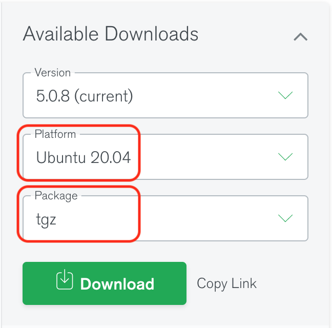
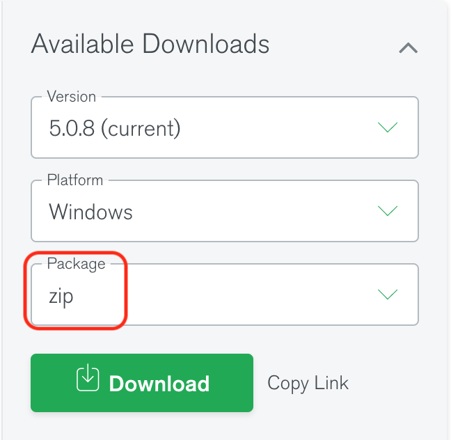
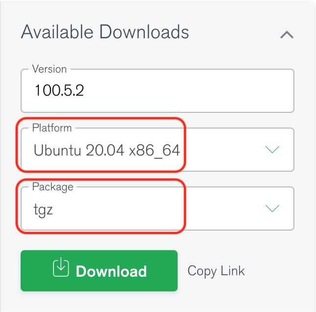
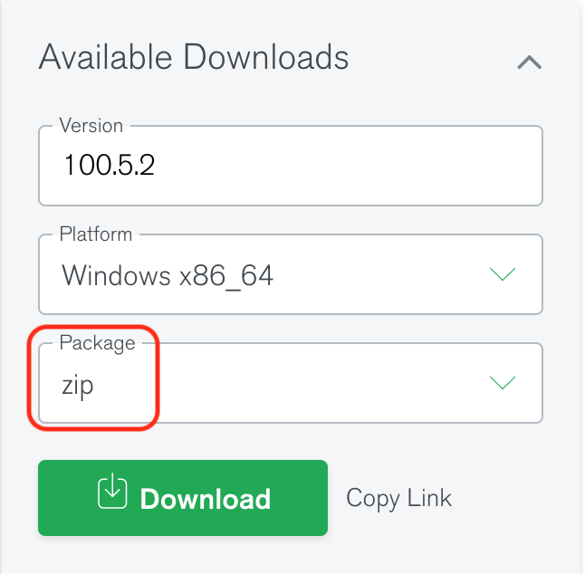

# Lab 7

## Objectives

* Understand the document database model.
* Manipulate a set of documents in a database.
* Understand how MongoDB deals with the flexibility of the document data model.

---

## Prerequisites

* Download the following sample file [contacts.json](./contacts.json).
* Download [MongoDB Community Edition](https://www.mongodb.com/try/download/community). We will work with version **5.0.8 (current)**.
  * Linux (Ubuntu): Select `Ubuntu 20.04` in **Platform** and `tgz` in **Package**. Don't select other package types.
    * Direct link: [https://fastdl.mongodb.org/linux/mongodb-linux-x86_64-ubuntu2004-5.0.8.tgz](https://fastdl.mongodb.org/linux/mongodb-linux-x86_64-ubuntu2004-5.0.8.tgz)
    <p align="center"></p>
    * You may use the MongoDB for Ubuntu 18.04 if your system is that version.
  * macOS: Select `macOS` in **Platform**. The **Package** has only one option `tgz`.
    * Direct link: [https://fastdl.mongodb.org/osx/mongodb-macOS-x86_64-5.0.8.tgz](https://fastdl.mongodb.org/osx/mongodb-macOS-x86_64-5.0.8.tgz)
    <p align="center"></p>
    * You may use an older version of MongoDB (4.4 or 4.2) if your system is 10.13 or lower.
  * Windows: Select `Windows` in **Platform** and `zip` in **Package**. Don't select the `msi` package.
    * Direct link: [https://fastdl.mongodb.org/windows/mongodb-windows-x86_64-5.0.8.zip](https://fastdl.mongodb.org/windows/mongodb-windows-x86_64-5.0.8.zip)  
    <p align="center"></p>
* Download [MongoDB Database Tools](https://www.mongodb.com/try/download/database-tools). The current version is **100.5.2**.
  * Linux (Ubuntu): Select `Ubuntu 20.04 x86 64` in **Platform** and `tgz` in **Package**. Don't select the `deb` package.
    * Direct link: [https://fastdl.mongodb.org/tools/db/mongodb-database-tools-ubuntu2004-x86_64-100.5.2.tgz](https://fastdl.mongodb.org/tools/db/mongodb-database-tools-ubuntu2004-x86_64-100.5.2.tgz)
    <p align="center"></p>
  * macOS: Select `macOS x86_64` in **Platform**. The **Package** has only one option `zip`.
    * Direct link: [https://fastdl.mongodb.org/tools/db/mongodb-database-tools-macOS-x86_64-100.5.2.zip](https://fastdl.mongodb.org/tools/db/mongodb-database-tools-macOS-x86_64-100.5.2.zip)
    <p align="center"></p>
  * Windows: Select `Windows x86_64` in **Platform** and `zip` in **Package**. Don't select the `msi` package.
    * Direct link: [https://fastdl.mongodb.org/tools/db/mongodb-database-tools-windows-x86_64-100.5.2.zip](https://fastdl.mongodb.org/tools/db/mongodb-database-tools-windows-x86_64-100.5.2.zip)
    <p align="center"></p>
* If you use the provided virtual machine, it comes with MongoDB pre-installed.
* For testing purposes, you can use the [online web-based MongoDB version](https://mws.mongodb.com/?version=5.0)

---

## Lab Work

### I. Setup MongoDB and Database Tools (20 minutes)

* Note: If you use the provided virtual machine, you will find that MongoDB is pre-installed.

1. Download the corresponding archive files (either *.zip* or *.tgz*) according to your system.
2. Extract the downloaded MongoDB archive file to your course directory `cs167`.
    * Linux (Ubuntu): `~/cs167/mongodb-linux-x86_64-ubuntu2004-5.0.8`
    * macOS: `~/cs167/mongodb-macOS-x86_64-5.0.8`
    * Windows: `C:\cs167\mongodb-win32-x86_64-windows-5.0.8`
3. Extract the downloaded MongoDB database tools archive file, copy or move all the files inside the `bin` directory to the installed MongoDB's `bin` directory. Available files (on Windows, those should have `.exe` extension) are:
    * bsondump
    * mongoexport
    * mongoimport
    * mongostat
    * mongodump
    * mongofiles
    * mongorestore
    * mongotop

4. Configure environment variables.
    * Linux (Ubuntu):
        1. Add `export MONGODB_HOME="/home/$LOGNAME/cs167/mongodb-linux-x86_64-ubuntu2004-5.0.8"`
        2. Add `$MONGODB_HOME/bin` to `PATH`. Separator is `:`
        3. Reload the profile via `source` command or restart the terminal
    * macOS:
        1. Add `export MONGODB_HOME="/Users/$LOGNAME/cs167/mongodb-macOS-x86_64-5.0.8"`
        2. Add `$MONGODB_HOME/bin` to `PATH`. Separator is `:`
        3. Reload the profile via `source` command or restart the terminal
    * Windows:
        1. Add a user variable with name `MONGODB_HOME` and value `C:\cs167\mongodb-win32-x86_64-windows-5.0.8`
        2. Add `%MONGODB_HOME%\bin` to `Path` variable.
        3. Restart the terminal.

5. Create a `$MONGODB_HOME/data` directory where your data will be stored.
    * Linux and macOS: `mkdir $MONGODB_HOME/data`
    * Windows: `mkdir "%MONGODB_HOME%\data"` for CMD or `mkdir "$Env:MONGODB_HOME\data"` for PowerShell and Windows terminal
6. Start the MongoDB server by running the following command (you must keep the tab/window open while doing this lab).
    * Linux and macOS

        ```bash
        mongod --dbpath $MONGODB_HOME/data
        ```

    * Windows CMD

        ```bat
        mongod --dbpath "%MONGODB_HOME%\data"
        ```

    * Windows PowerShell or Windows Terminal

        ```powershell
        mongod --dbpath "$Env:MONGODB_HOME\data"
        ```

    On macOS, if you see the following error, click `Cancel`.
    <p align="center"></p>

    Run the following command (you must be a system administrator to use `sudo`).

    ```bash
    sudo spctl --master-disable
    ```

    Then rerun the `mongod` command above. Once it starts, you can run the following command to revert the changes.

    ```bash
    sudo spctl --master-enable
    ```

    See more details about macOS [GateKeeper](https://www.makeuseof.com/how-to-disable-gatekeeper-mac/).

---

### II. Data Manipulation (60 minutes)

1. Import the sample file into a new collection named `contacts`. You will need to use [`mongoimport`](https://www.mongodb.com/docs/database-tools/mongoimport/) command from the database tool. You may use [`--collection`](https://www.mongodb.com/docs/database-tools/mongoimport/#std-option-mongoimport.--collection) and [`--jsonArray`](https://www.mongodb.com/docs/database-tools/mongoimport/#std-option-mongoimport.--jsonArray) two options.
    * ***(Q1) What is your command?***
    * ***(Q2) What is the output of the above command?***

2. Retrieve all the users sorted by `Name` (default order).
    * ***(Q3) What is your command?***

    Copy the output to a file named `q3.txt`. Your `.txt` file should look like

    ```json
    { ... }
    { ... }
    { ... }
    ```

    Or with [`cursor.pretty()`](https://www.mongodb.com/docs/manual/reference/method/cursor.pretty/)

    ```json
    {
        ...
    }
    {
        ...
    }
    { 
        ...
    }
    ```

    Hint: Use [`db.collection.find()`](https://www.mongodb.com/docs/manual/reference/method/db.collection.find/#mongodb-method-db.collection.find) and [`cursor.sort()`](https://www.mongodb.com/docs/manual/reference/method/cursor.sort/#mongodb-method-cursor.sort).

3. List only the `_id` and `Name` sorted in **reverse alphabetical order** by `Name` (Z-to-A).
    * ***(Q4) What is your command?***

    Copy the output to `q4.txt`. The file format should be the same as step 2. The output should not contain other attributes other than `_id` and `Name`.

    Hint: You will need to use [`projection`](https://www.mongodb.com/docs/manual/reference/method/db.collection.find/#projection) and [Ascending/Descending Sort](https://www.mongodb.com/docs/manual/reference/method/cursor.sort/#ascending-descending-sort).

4. ***(Q5) Is the comparison of the attribute `Name` case-sensitive?***

    Show how you try this with the previous query and include your answer.

    Hint: To check if a comparison is case sensitive, there must be at least one string with upper case letter and one string with lower case letters. For example, given "**A**pple" and "**B**erry", "**A**pple" **&lt;** "**B**erry" in both case sensitive and insensitive comparisons. However, if you have "**a**pple" and "**B**erry", it will be "**a**pple" **&gt;** "**B**erry" in a case sensitive comparison and "**a**pple" **&lt;** "**B**erry" in a case insensitive comparison. Note that you cannot tell "**A**pple" and "**b**erry" because '**A**' **&lt;** '**b**' in both case sensitive and insensitive comparisons.

    You may check [ASCII table](https://theasciicode.com.ar/).

5. Repeat step 3 above but do not show the `_id` field.
    * ***(Q6) What is your command?***

   Copy the output to `q6.txt` using the same format. The output should only contain attribute `Name`.

6. Insert the following document to the collection.

    ```text
    {Name: {First: "David", Last: "Bark"}}
    ```

    * ***(Q7) Does MongoDB accept this document while the `Name` field has a different type than other records?***
    * ***(Q8) What is your command?***
    * ***(Q9) What is the output of the above command?***

    Hint: Use [`db.collection.insertOne()`](https://www.mongodb.com/docs/manual/reference/method/db.collection.insertOne/#db.collection.insertone--).

7. Rerun step 3, which lists the records sorted by `Name`.
    * ***(Q10) Where do you expect the new record to be located in the sort?***

8. Insert the following document into the `contacts` collection.

    ```text
    {Name: ["David", "Bark"]}
    ```

    * ***(Q11) What is your command?***
    * ***(Q12) What is the output of the above command?***

9. Rerun step 3.
    * ***(Q13) Where do you expect the new document to appear in the sort order. Verify your answer and explain after running the query.***

10. Rerun step 3, but this time sort the `Name` in **ascending** order.
    * ***(Q14) Where do you expect the last inserted record, `{Name: ["David", "Bark"]}` to appear this time? Does it appear in the same position relative to the other records? Explain why or why not.***

    Copy the output to `q14.txt`. The file format should be the same as step 2. The output should not contain other attributes other than `_id` and `Name`.

    Hint: [Ascending/Descending Sort](https://www.mongodb.com/docs/manual/reference/method/cursor.sort/#ascending-descending-sort).

11. Build an index on the `Name` field for the  `contacts` collection.
    * ***(Q15) Is MongoDB able to build the index on that field with the different value types stored in the `Name` field?***
    * ***(Q16) What is your command?***
    * ***(Q17) What is the output of the above command?***

    Hint: Use [`db.collection.createIndex()`](https://www.mongodb.com/docs/manual/reference/method/db.collection.createIndex/#mongodb-method-db.collection.createIndex).

---

### III. Submission (2 minutes)

1. Write your answers using the [template `README.md`](https://raw.githubusercontent.com/aseldawy/CS167/master/Labs/Lab7/CS167-Lab7-README.md) file.
2. Make a `.tar.gz` or `.zip` file with `README.md`, `q3.txt`, `q4.txt`, `q6.txt` and `q14.txt`.

    Your archive file should be:

    ```text
    <UCRNetID>_lab7.{tar.gz | zip}
      - README.md
      - q3.txt
      - q4.txt
      - q6.txt
      - q14.txt
    ```

3. Do not forget to include your information as you do in other labs.
4. No separate code is required for this lab.
