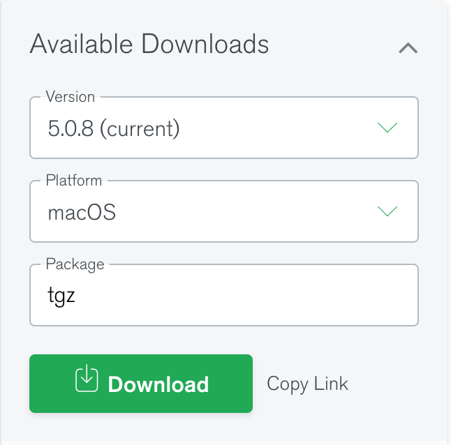
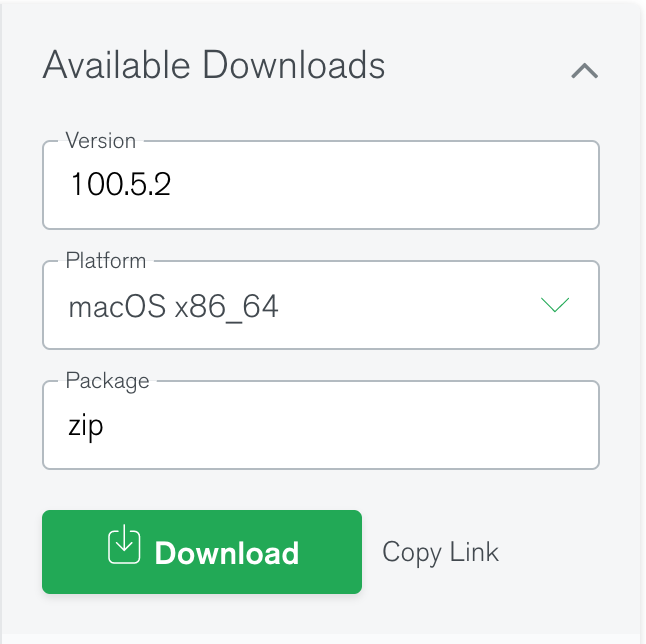

# Lab 7

## Objectives

* Understand the document database model.
* Manipulate a set of documents in a database.
* Understand how MongoDB deals with the flexibility of the document data model.

## Prerequisites

* Download the following sample file [contacts.json](./contacts.json).
* Download [MongoDB Community Edition](https://www.mongodb.com/try/download/community). We will work with version **5.0.8 (current)**.
  * Linux (Ubuntu): Select `Ubuntu 20.04` in **Platform** and `tgz` in **Package**. Don't select other package types.
    * Direct link: [https://fastdl.mongodb.org/linux/mongodb-linux-x86_64-ubuntu2004-5.0.8.tgz](https://fastdl.mongodb.org/linux/mongodb-linux-x86_64-ubuntu2004-5.0.8.tgz)
    <p align="center"></p>
  * MacOS: Select `macOS` in **Platform**. The **Package** has only one option `tgz`.
    * Direct link: [https://fastdl.mongodb.org/osx/mongodb-macos-x86_64-5.0.8.tgz](https://fastdl.mongodb.org/osx/mongodb-macos-x86_64-5.0.8.tgz)
    <p align="center"></p>
  * Windows: Select `Windows` in **Platform** and `zip` in **Package**. Don't select the `msi` package.
    * Direct link: [https://fastdl.mongodb.org/windows/mongodb-windows-x86_64-5.0.8.zip](https://fastdl.mongodb.org/windows/mongodb-windows-x86_64-5.0.8.zip)  
    <p align="center"></p>
* Download [MongoDB Database Tools](https://www.mongodb.com/try/download/database-tools). The current version is **100.5.2**.
  * Linux (Ubuntu): Select `Ubuntu 20.04 x86 64` in **Platform** and `tgz` in **Package**. Don't select the `deb` package.
    * Direct link: [https://fastdl.mongodb.org/tools/db/mongodb-database-tools-ubuntu2004-x86_64-100.5.2.tgz](https://fastdl.mongodb.org/tools/db/mongodb-database-tools-ubuntu2004-x86_64-100.5.2.tgz)
    <p align="center"></p>
  * MacOS: Select `macOS x86_64` in **Platform**. The **Package** has only one option `zip`.
    * Direct link: [https://fastdl.mongodb.org/tools/db/mongodb-database-tools-macos-x86_64-100.5.2.zip](https://fastdl.mongodb.org/tools/db/mongodb-database-tools-macos-x86_64-100.5.2.zip)
    <p align="center"></p>
  * Windows: Select `Windows x86_64` in **Platform** and `zip` in **Package**. Don't select the `msi` package.
    * Direct link: [https://fastdl.mongodb.org/tools/db/mongodb-database-tools-windows-x86_64-100.5.2.zip](https://fastdl.mongodb.org/tools/db/mongodb-database-tools-windows-x86_64-100.5.2.zip)
    <p align="center"></p>
* If you use the virtual machine, it comes with MongoDB pre-installed.
* For testing purposes, you can use the [online web-based MongoDB version](https://mws.mongodb.com/?version=5.0)

## Lab Work

### I. Setup MongoDB (20 minutes)

Note: If you use the virtual machine, you will find that MongoDB is pre-installed.

1. Make sure that you download appropriate distribution for your system, e.g., Windows, Linux, or Mac, and that you downloaded version 4.2.14. For Windows users, make sure to download the zip version not msi since the former ships with all command-line tools that we will need such as mongoimport.
2. Extract the downloaded package somewhere in your home directory, e.g., under `$HOME/Applications`.
3. Add `<mongodb>/bin` directory to your executable path as we did in Lab 1. This step depends on your system and where you extracted the downloaded binaries.
4. Create a `<mongodb>/data` directory where your data will be stored.
5. Start the MongoDB server by running the following command.

```shell
mongod --dbpath <mongodb>/data
```

Do not forget to replace `<mongodb>` with your MongoDB installation directory.

### II. Data Manipulation (60 minutes)

* Note: For all the questions below, write down your query and the answer to any questions. Include all the queries that you ran along with the answers in a README file.

1. (Q1) Import the sample file into a new collection named `contacts`. Hint: Use the [`mongoimport`](https://docs.mongodb.com/database-tools/mongoimport/) command.
3. (Q2) Retrieve all the users sorted by name.
4. (Q3) List only the `id` and `name`s sorted in reverse alphabetical order by `name` (Z-to-A).
5. (Q4) Is the comparison of the attribute `name` case-sensitive? Show how you try this with the previous query and include your answer.
6. (Q5) Repeat Q3 above but do not show the _id field.
7. (Q6) Insert the following document to the collection.

    ```text
    {Name: {First: "David", Last: "Bark"}}
    ```

    Does MongoDB accept this document while the `name` field has a different type than other records?
8. Rerun Q3, which lists the records sorted by `name`. (Q7) Where do you expect the new record to be located in the sort order? Verify the answer and explain.
9. Insert the following document into the users collection.

    ```text
    {Name: ["David", "Bark"]}
    ```

10. Repeat Q3. (Q8) Where do you expect the new document to appear in the sort order. Verify your answer and explain after running the query.
11. Repeat Q3 again with all the objects that you inserted, but this time sort the name in *ascending* order. (Q9) Where do you expect the last inserted record, `{Name: ["David", "Bark"]}` to appear this time? Does it appear in the same position relative to the other records? Explain why or why not.
12. (Q10) Build an index on the Name field for the users collection. Is MongoDB able to build the index on that field with the different value types stored in the Name field?

### II. Submission (15 minutes)

1. Send only a README file that contains both the queries that you ran and the answers to the questions above.
2. Do not forget to include your information as you do in other labs.
3. No separate code is required for this lab.
