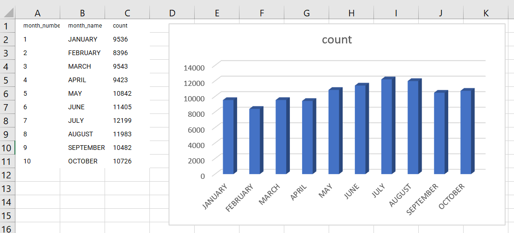

# Lab 8

## Objectives

* Manage big data using AsterixDB.
* Download real datasets and load them into AsterixDB.
* Run SQL queries and visualize the results.

## Prerequisites

* Download [AsterixDB-0.9.8](http://www.apache.org/dyn/closer.lua/asterixdb/asterixdb-0.9.8/asterix-server-0.9.8-binary-assembly.zip)
* Download Oracle JRE 11 or later. JRE 8 will not work for this lab.
* Download and decompress this [sample file](chicago_crimes_sample.csv.gz) for testing.
* Download the [template spreadsheet](CS167_lab8-visualization-template.xlsx) for the visualizations requested later.

## Lab Work

### I. Install AsterixDB - 10 minutes (in home)

1. Install JRE (or JDK) 11 or later. If you still have JDK 8 downloaded, make sure that your executable `PATH` environment variable points to Java 11. To confirm, run `java -version` from command line. You should see something like the following. (The actual version will vary but it should not be 1.8.)
```
java version "17.0.1" 2021-10-19 LTS
Java(TM) SE Runtime Environment (build 17.0.1+12-LTS-39)
Java HotSpot(TM) 64-Bit Server VM (build 17.0.1+12-LTS-39, mixed mode, sharing)
```

2. Extract AsterixDB into your `cs167` under your home directory.

3. To start a local cluster of AsterixDB, open a command line window at the extracted AsterixDB directory and run the following command.
```shell
opt/local/bin/start-sample-cluster
```
You should see something like the following.


To confirm that AsterixDB is running, point your web browser to the link [http://127.0.0.1:19006]. You should see AsterixDB interface as shown below.


You can now close this window if you want.

## III. Review the builtin function
1. Go through the [builtin functions of AsterixDB](https://asterixdb.apache.org/docs/0.9.8/sqlpp/builtins.html). Focus on numeric, string, temporal, and aggregate functions.
2. You can directly run the queries into the web interface of AsterixDB for testing. ***(Q1) Run the query `get_month(current_date())`. What is the result***.

## II. Load Chicago Crime dataset into AsterixDB (20 minutes)
1. Create a dataverse for chicago crimes as below.
```SQL
DROP DATAVERSE chicago_crimes_sample IF EXISTS;
CREATE DATAVERSE chicago_crimes_sample;
```
2. Create a data type for crimes.
```SQL
USE chicago_crimes_sample;

CREATE TYPE ChicagoCrimeType AS {
    longitude: double?,
    latitude: double?,
    id: int32,
    case_number: string?,
    date_value: string?,
    block: string?,
    iucr: string?,
    primary_type: string?,
    description: string?,
    location_description: string?,
    arrest: string?,
    domestic: string?,
    beat: double?,
    district: double?,
    ward: double?,
    community_area: double?,
    fbi_code: string?,
    x_coordinate: double?,
    y_coordinate: double?,
    year: int32?,
    updated_on: string?
};
```

3. Create a dataset and load the downloaded data. We assume that the downloaded file has been decompressed and is available under `C:\Users\student\cs167\chicago_crimes_sample.csv`.
```SQL
USE chicago_crimes_sample;

DROP DATASET ChicagoCrimes IF EXISTS;
CREATE DATASET ChicagoCrimes (ChicagoCrimeType) PRIMARY KEY id;

LOAD DATASET ChicagoCrimes USING localfs (("path"="127.0.0.1:///Users/student/cs167/chicago_crimes_sample.csv"), ("format"="delimited-text"), ("delimiter"=","), ("header"="true"));

SELECT COUNT(*) AS count
FROM ChicagoCrimes;
```

If the insertion is successful, you should see the following output.
```json
[
        {
                "count": 125070
        }
]
```

## III. Analyze crime data (45 minutes)
1. Count how many arrests involve an arrest, i.e., `arrest="true"`?
Hint, use the following SQL query.
```SQL
SELECT COUNT(arrest)
FROM ChicagoCrimes
WHERE arrest="true";
```

2. Which unique types of crimes have been recorded at `GAS STATION` locations?
***(Q2) Which query did you use and what is the answer?***

3. Find the number of crimes by year and order the results by the number of crimes in descending order.
***(Q3) Include the query in your README file***

Hint: Use the function `parse_datetime` with format `MM/DD/YYYY hh:mm:ss a` to parse the date. Then, use the function `get_year` to get the year.

Hint: The results will look like the following.
```
[
        {
                "year": 2018,
                "count": 8155
        },
        {
                "year": 2019,
                "count": 7931
        },
        {
                "year": 2017,
                "count": 7872
        },
        {
                "year": 2004,
                "count": 7520
        },
        {
                "year": 2003,
                "count": 7270
        },
        {
                "year": 2008,
                "count": 7162
        },
        {
                "year": 2011,
                "count": 6970
        },
        {
                "year": 2012,
                "count": 6950
        },
        {
                "year": 2006,
                "count": 6858
        },
        {
                "year": 2005,
                "count": 6814
        }
]
```

4. ***(Q4) Which district has the most number of crimes? Include the query and the answer in the README file.***

Hint: Use `ORDER BY` and `LIMIT` to select the top record.

## IV. Visualize the result (30 minutes)
In this part, we will run the query in AsterixDB and visualize the result using a spreadsheet. Download this [template spreadsheet](CS167_lab8-visualization-template.xlsx) to help you with this part.

1. Run the following query to select the number of crimes per month over all years.
```SQL
USE chicago_crimes_sample;

SELECT month_number, month_name, count(*) AS count FROM (
  SELECT print_datetime(parse_datetime(date_value, "MM/DD/YYYY hh:mm:ss a"), "MMMM") AS month_name, get_month(parse_datetime(date_value, "MM/DD/YYYY hh:mm:ss a")) AS month_number
  FROM ChicagoCrimes
) AS months
GROUP BY month_name, month_number
ORDER BY month_number;
```

The answer will look similar to the following.

month_number	| month_name	| count
--------------- | ------------- | -----
1	            | JANUARY       | 9536
2	            | FEBRUARY      | 8396
3	            | MARCH         | 9543
4	            | APRIL         | 9423
5	            | MAY           | 10842
6	            | JUNE          | 11405
7	            | JULY          | 12199
8	            | AUGUST        | 11983
9	            | SEPTEMBER     | 10482
10	            | OCTOBER       | 10726

2. To import this data into a CSV file, choose `TABLE` as the output format and then copy/paste the table into an Excel spreadsheet.
3. Create a visualization using Excel such as the following one.



You can easily do that by copy/pasting the query results in the spreadsheet and the visualization should populate automatically.

4. Now, let us do a more complicated example. We would like to visualize the number of crimes by month/year so that we can see the trend over time.
5. Update the query above to produce a result simiar to the following.

year_month | count
---------- | -----
2001/01    | 4
2001/02    | 2
2001/04    | 3
2001/05    | 4
2001/07    | 6
2001/08    | 4
...        | ...

***(Q5) Include the query in your submission.***

6. Note that AsterixDB will only show the first 10 results by default.
***(Q6) What is the total number of results produced by this query (not only the shown ones)?***

7. Copy the result into the second sheet of the provided Excel spreadsheet to produce a visualization similar to the one below.


## V. Submission (15 minutes)

1. Create a README file and add all your answers to it. Do not forget to add your information similar to previous labs. Use this [template](CS167-Lab8-README.md).
2. Attach the spredsheet after filling it in with the query results.
3. Similar to all labs, do not include any additional files such as the compiled code, input, or output files.

Submission file format:

```console
<UCRNetID>_lab8.{tar.gz | zip}
  - README.md
  - visualizations.xslx
```

## FAQ
Q: When I run `start-sample-cluster`, I get the following error.

```
Error: A JNI error has occurred, please check your installation and try again
Exception in thread "main" java.lang.UnsupportedClassVersionError: org/apache/asterix/clienthelper/AsterixHelper has been compiled by a more recent version of the Java Runtime (class file version 55.0), this version of the Java Runtime only recognizes class file versions up to 52.0
        at java.lang.ClassLoader.defineClass1(Native Method)
        at java.lang.ClassLoader.defineClass(ClassLoader.java:763)
        at java.security.SecureClassLoader.defineClass(SecureClassLoader.java:142)
        at java.net.URLClassLoader.defineClass(URLClassLoader.java:468)
        at java.net.URLClassLoader.access$100(URLClassLoader.java:74)
        at java.net.URLClassLoader$1.run(URLClassLoader.java:369)
        at java.net.URLClassLoader$1.run(URLClassLoader.java:363)
        at java.security.AccessController.doPrivileged(Native Method)
        at java.net.URLClassLoader.findClass(URLClassLoader.java:362)
        at java.lang.ClassLoader.loadClass(ClassLoader.java:424)
        at sun.misc.Launcher$AppClassLoader.loadClass(Launcher.java:349)
        at java.lang.ClassLoader.loadClass(ClassLoader.java:357)
        at sun.launcher.LauncherHelper.checkAndLoadMain(LauncherHelper.java:495)
Starting sample cluster...
```

A: This indicates that you are running Java 8. Update the PATH environment variable to point to Java 11 or later and rerun.